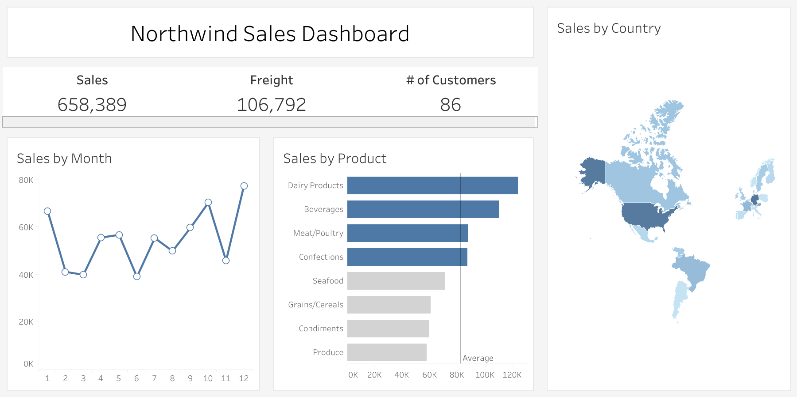

# Sales-Data-Analysis-and-Visualization-for-Business-Intelligence

## Introduction
This project is based on the database provided [here](https://github.com/pthom/northwind_psql).

I interacted with PostgreSQL and query to gain deeper patterns about the data. After that I used Tableau to make a dashboard on which I indicate my initial findings.

## Database ERD
You can use northwind.sql to create tables and do initializations. Import quary.sql to see the code that I made.

## Tableau Dashboard
The source file for the Tableau is in Northwind.twb. Additionally, before I implemented dashboard visualization, I grasped the key inforamtion by using joins among table and created a table which is saved in .csv file.

## Summary
 
